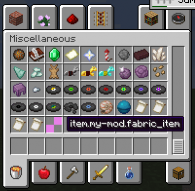
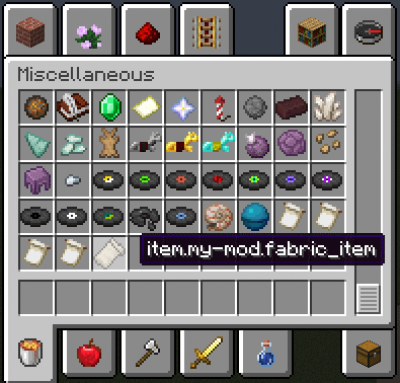

- ## Introducción
  collapsed:: true
	- Vamos a necesitar crear un **item** y darle una textura.
		- Para añadir un comportamiento adicional al elemento necesitaremos una clase de articulo personalizada.
- ## Registrando un item
  collapsed:: true
	- El constructor toma en un `Item.Settings`(o a `FabricItemSettings`)
	  collapsed:: true
		- Instancia, que se utiliza para establecer propiedades de artículos tales como la categoría de inventario, durabilidad y conteo de usos.
		- ```java
		  public class ExampleMod implements ModInitializer { 
		  
		      // an instance of our new item
		      public static final Item CUSTOM_ITEM = new Item(new FabricItemSettings().group(ItemGroup.MISC));- 
		      [...] 
		  }
		  ```
	- Usaremos el registro de vanila para registrar nuevos contenidos.
		- La sintaxis basica es: `Registry#register(Registry Type, Identifier, Content)`
		  collapsed:: true
			- Los tipos de registro se almacenan en la clase `Registry`, y el identificador es lo que etiqueta su contenido.
			  collapsed:: true
				- El contenido es una instancia de lo que estas agregando.
				- Esto se puede llamar en cualquier lugar siempre y cuando ocurra dirante la inicializacion
		- collapsed:: true
		  ```java
		  public class ExampleMod implements ModInitializer {
		  
		      // an instance of our new item
		      public static final Item CUSTOM_ITEM = new Item(new FabricItemSettings().group(ItemGroup.MISC));
		  
		      @Override
		      public void onInitialize() {
		               Registry.register(Registry.ITEM, new Identifier("tutorial", "custom_item"), CUSTOM_ITEM);
		      }
		  }
		  ```
			- Nuestro nuevo item ha sido añadido a Minecraft.
			  collapsed:: true
				- Debebemos correr Minecraft con `runClient` para verlo en accion
				  collapsed:: true
					- 
- ## Agregar texturas al item
	- Darle una textura a un item requiere un modelo .json y una imagen de texturas.
		- Vamos a nesecitar añadir estos a nuestro directorio de recursos
			- Donde:
				- ```java
				  Modelo del item: .../resources/assets/tutorial/models/item/custom_item.json
				  Texura del item: .../resources/assets/tutorial/textures/item/custom_item.png
				  ```
					- Si nuestro item se registro correctamente, el juego se quejara de que falta un archivo, con un mensaje como este:
						- ```
						  [Server-Worker-1/WARN]: Unable to load model: 'tutorial:custom_item#inventory' referenced from: tutorial:custom_item#inventory: java.io.FileNotFoundException: tutorial:models/item/custom_item.json
						  ```
							- De forma muy conveniente no dice donde deberian estar nuestros bienes
								- Si tenemos dudad debemos revisar el log
	- Platilla basica del modelo y textura de un item
		- ```
		  {
		    "parent": "item/generated",
		    "textures": {
		      "layer0": "tutorial:item/custom_item"
		    }
		  }
		  ```
			- El padre de un item(`"parent"`) cambia la forma en la que se renderiza en la mano nuestro item "hijo"
				- Esto es muy util para cosas como items de bloques en el inventario.
			- `"item/handheld"`  se utiliza para herramientas que se tienen desde la parte inferior izquierda de la textura.
			- `"textures/layer0"` es la ubicacion del archivo de imagen de nuestro item.
			- ### **Resultado final texturizado:**
				- 
				  collapsed:: true
					- [Textura utilizada de ejemplo](https://i.imgur.com/CqLSMEQ.png)